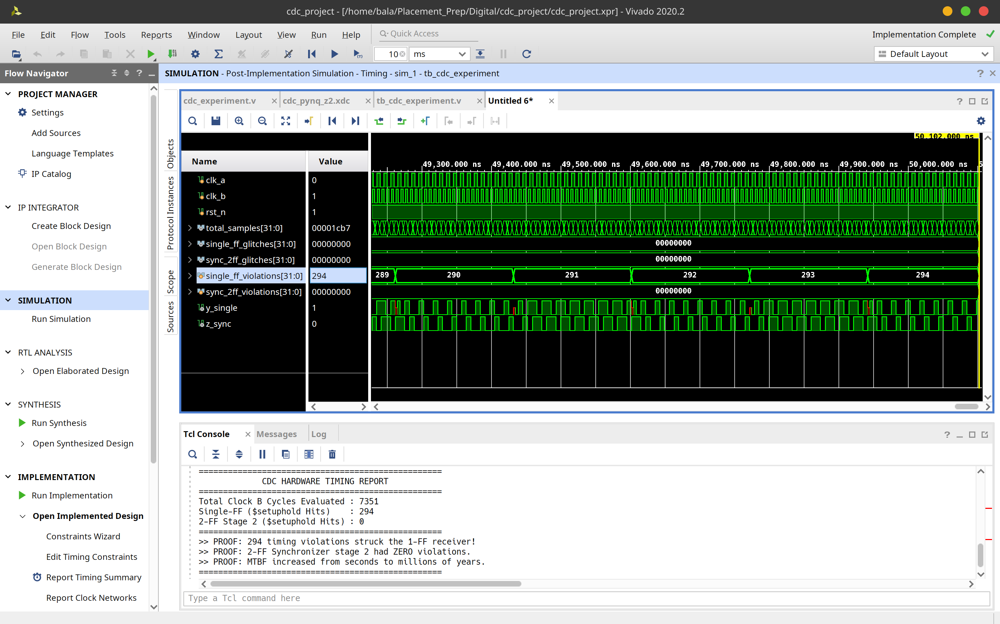

# ⚡ 2-Stage Flip-Flop Synchronizer: Hardware CDC Proof-of-Concept

[](#)
[-blue.svg)](#)
[](#)
[](#)

A hardware-level Proof of Concept (PoC) demonstrating **Clock Domain Crossing (CDC) setup/hold aperture violations** and experimentally validating how a **2-Stage Flip-Flop (2-FF) Synchronizer** mitigates metastability and exponentially improves **Mean Time Between Failures (MTBF)**.
# 2-Stage Flip-Flop Synchronizer: Hardware CDC Proof-of-Concept

---

## Executive Summary

In pure behavioral RTL simulation, digital flip-flops operate as mathematical abstractions with zero setup/hold apertures, deterministically resolving races to binary states (0 or 1). As a result, metastability and CDC collisions remain invisible in standard RTL simulation.

By running Post-Implementation Timing Simulation with physical Standard Delay Format (SDF) back-annotation on a Xilinx Zynq-7020 architecture, this project captures:
* 294 Timing Aperture Violations (`$setuphold`) on an unsynchronized 1-FF receiver.
* 0 Violations on the second stage of the 2-FF synchronizer.

---

## Experimental Results

Simulated over a 50 us window across 7,351 Clock B cycles:

| Metric | 1-FF Unsynchronized Path | 2-Stage Synchronizer Path | Verdict |
| :--- | :---: | :---: | :--- |
| **Evaluated Clock B Cycles** | 7,351 | 7,351 | Equal sample baseline |
| **UNISIM `$setuphold` Violations** | **294** | **0** | 1-FF repeatedly violates timing |
| **Metastability Risk Window** | Critical (T_resolve ~ 0) | Shielded (T_resolve ~ T_clk_b) | 100% Isolation on Stage 2 |

### Waveform Analysis

* `single_ff_violations` steps upward to 294 at every physical aperture collision.
* `sync_2ff_violations` stays flat at 0 across the entire duration.

---

## Architectural Overview

Data originating in Domain A (100 MHz) is sampled asynchronously by Domain B (147.058 MHz) via two parallel topologies:

* **Unsynchronized Single-FF Path:** The signal from Domain A is directly sampled by a destination register in Domain B. Because transitions arrive asynchronously relative to Clock B, setup/hold times are routinely violated, pushing the flip-flop into an indeterminate metastable condition.
* **2-Stage Synchronizer Path:** The asynchronous signal is routed through two back-to-back registers clocked by Clock B. The first register captures the asynchronous line and absorbs any aperture collisions. The output is given a full Clock B cycle (6.8 ns) to settle before being sampled by the second register, shielding all downstream logic.

### MTBF Formulation

MTBF = exp(T_resolve / tau) / (T_w * f_clk * f_data)

* **Single-FF:** T_resolve ~ 0, which causes MTBF to collapse to seconds or minutes under continuous toggle rates.
* **2-Stage FF:** T_resolve ~ T_clk_b = 6.8 ns. Allowing the internal latch to resolve before Stage 2 samples boosts MTBF to millions of operating hours.

---

## Hardware and Toolchain

* **Target Board:** Tul PYNQ-Z2 (Xilinx Zynq-7000 SoC XC7Z020-1CLG400C)
* **EDA Tool:** Xilinx Vivado Design Suite 2020.2+
* **Simulation Type:** Post-Implementation Timing Simulation (`xsim` / `xelab`)
* **Languages:** Verilog HDL, Xilinx Design Constraints (XDC)

---

## Key Vivado Configuration Settings

To expose physical timing collisions instead of allowing the simulator to silently mask them:

1. **Do Not Group Clocks as Asynchronous during SDF Generation:** Omit `set_clock_groups -asynchronous` in your simulation XDC so Vivado annotates setup/hold arcs across domain boundaries into the timing netlist.
2. **Disable Elaboration Relax Mode:** In Settings -> Simulation -> Elaboration, uncheck `--relax` to prevent `xelab` from suppressing setup/hold checks and notifiers.
3. **Avoid Duplicate Command-Line Switches:** Do not add `-transport_int_delays` into `more_options` because Vivado includes it automatically; duplicating it triggers fatal error `[XSIM 43-3984]`.
4. **UNISIM Notifier Interception:** The testbench directly hooks into `uut.y_single_reg.notifier` to track every violation generated by the underlying `FDCE` primitive and uses `force` / `release` to display `1'bx` on the waveform.

---

## Reproduction Steps

1. **Clone this repository**

2. **Launch Vivado and create a project targeting the PYNQ-Z2 board (`xc7z020clg400-1`).**

3. **Add sources:**
   * Add `cdc_experiment.v` to Design Sources.
   * Add `cdc_pynq_z2.xdc` to Constraints.
   * Add `tb_cdc_experiment.v` to Simulation Sources.

4. **Run Implementation:**
   * Click **Run Implementation** and wait for routing completion.

5. **Run Post-Implementation Timing Simulation:**
   * Go to **Flow Navigator -> Simulation -> Run Post-Implementation Timing Simulation**.
   * In the Tcl Console, execute:
     ```tcl
     run -all
     ```

6. **Verify Results:** Check console banner output for the **294 vs 0** confirmation and inspect the waveform.
